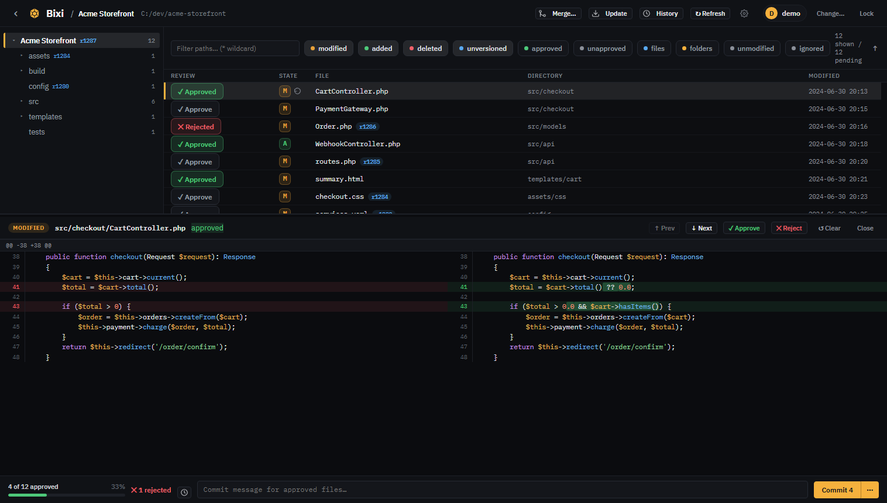
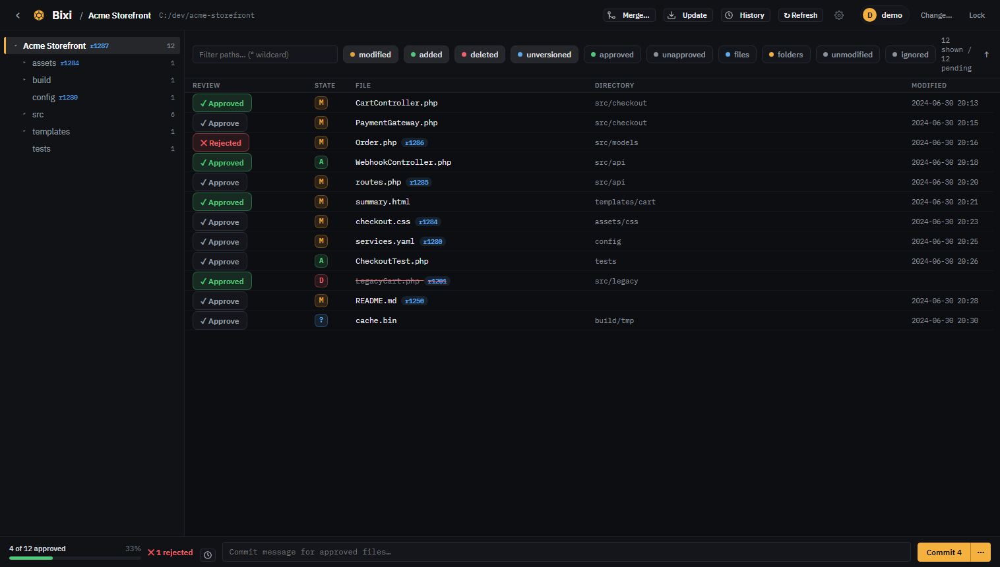

# Bixi

**Review pending Subversion changes in your browser** — approve or reject them
file by file, then commit the approved set with a message. A self-contained PHP
app that's a lighter-weight, browser-based alternative to a full SVN GUI.

Drop the folder onto any machine with **PHP** and the **`svn`** command-line
client, run one launcher, and review your working copy in the browser. No
database, no Composer, no build step.



## Features

- **Review pending changes** across large working copies — thousands of modified
  files are handled with a single `svn status` call and a virtualized file list.
- **Per-file approve / reject** with notes, tracked as review state so you can
  work through a big changeset over time.
- **Side-by-side diffs** — a built-in, syntax-highlighted in-browser diff, plus
  optional hand-off to an external desktop diff tool (VS Code, TortoiseSVN, Meld,
  Beyond Compare, FileMerge, …).
- **Commit the approved set** with a message; unversioned approved files are
  `svn add`-ed first, then committed together.
- **Check out from a URL** — create a new working copy from a repository URL
  (optionally at a specific revision or a shallow depth) and register it in one
  step, right from the dashboard.
- **Multiple projects** — register any number of local working copies.
- **AI-ready rejections** — rejection notes double as a fix list an AI coding
  assistant can work through ([see below](#review-with-an-ai-in-the-loop)).
- **Cross-platform** — Windows, macOS, and Linux.



## Review with an AI in the loop

Rejections in Bixi aren't just bookkeeping — the reason **Reject takes a note**
is so a mass review can end as a hand-off to an AI coding assistant:

1. **Sweep the changeset in Bixi.** Approve what's good; reject each problem
   file with a note saying what's wrong ("escape this output before rendering",
   "wrong null-guard — check the array key instead", …).
2. **Hand the rejections to your assistant.** Review state is plain JSON under
   `data/`, and the repo ships **[AI-FIXES.md](AI-FIXES.md)** — a self-contained
   instructions file any coding assistant can follow to locate every rejected
   file in your working copy and fix it, guided by your notes. For example:

   ```text
   Read AI-FIXES.md in C:\tools\bixi and follow it for the project named
   "MyProject": fix every rejected file, using its rejection note as the
   instruction. Don't commit or run any state-changing svn commands —
   I'll re-review and commit in Bixi.
   ```

3. **Re-review the fixes.** Bixi fingerprints file content at review time, so
   the moment the assistant edits a rejected file, the stale rejection is
   discarded automatically and the file returns to the queue as unreviewed.
   Nothing to reset by hand — reject, fix, re-review, commit.

## Requirements

- **PHP 8.2+** on your `PATH` (`php -v`)
- **Subversion CLI 1.14+** (`svn`) on your `PATH` (`svn --version`)
- An **SVN working copy** to review — one you already have, or a fresh one you
  check out from a repository URL right in the app
- A modern browser

## Quick start

```bash
# 1. Get the code
git clone https://github.com/Noguska/bixi.git
cd bixi

# 2. Run it (app mode — built-in PHP server, recommended)
#    Windows:  double-click run.cmd
#    macOS/Linux:
chmod +x run.sh   # first time only
./run.sh
```

It serves at <http://127.0.0.1:8787/> and opens your browser. In the app:

1. **Sign in to SVN** (top-right) — one username/password used for repo access,
   stored under `data/` on this machine only.
2. **Add a project** — a name and the path to your working copy
   (e.g. `C:\projects\myproject` or `/home/me/projects/app`).
3. Click the project and start reviewing.

Full setup, hosting under Apache/nginx, external diff-tool configuration, and
troubleshooting are covered in **[INSTALL.md](INSTALL.md)**.

## How it works

The app is deliberately small and dependency-free. It shells out to the `svn`
CLI for all repository interaction and keeps every bit of state as JSON files
under `data/`.

- A **project** is `{id, name, path}`, where `path` is a local working copy (or a
  subdirectory of one).
- **Review state** is stored per file as `{status, notes, hash, when}`, keyed by
  repo-relative path. The `hash` fingerprints the file at review time; if the file
  changes afterward, the stale review is discarded and the file is treated as
  unreviewed again.
- **Committing** runs `svn add` on approved unversioned files, then
  `svn commit --targets` on the approved set, then clears those review entries.

Performance matters because working copies can hold thousands of changes, so the
app makes **one** `svn status --xml` call per refresh, hash-checks only files that
already have review records, sends the status list to the browser once, and
renders the file list with a windowed (virtualized) DOM.

### Project layout

```
index.php          UI shell (rendered client-side)
history.php        Standalone commit-history window (read-only)
api.php            JSON API endpoints (?action=...)
lib/svn.php        SVN CLI wrapper + XML status / unified-diff parsers
lib/desktop.php    Cross-platform desktop launching (diff tool / open / reveal)
lib/store.php      JSON file storage with locking
lib/util.php       Shared helpers
run.cmd / run.sh   App-mode launchers (serve via `php -S`)
assets/app.js      Frontend (state, virtual list, diff renderer)
assets/app.css     Styles
assets/vendor/     Vendored highlight.js + fonts (Inter, IBM Plex — offline)
data/              Per-install state (git-ignored; created on first run)
```

## Security notes

This tool shells out to `svn` and to your configured diff tool, and it can commit
to your repository. Run it for **trusted, local/LAN use only** — do not expose it
to the public internet. Your SVN password is stored under `data/`, which is
blocked from web access under Apache via `data/.htaccess`; anyone who can reach
the running app can use that saved login.

## Project status

Bixi is developed and published by Noguska Inc. and shared as-is. External pull
requests are not being accepted at this time. You're free to fork and adapt it
within the license terms below.

## License

Licensed under the **Apache License 2.0 with the Commons Clause** — see
[LICENSE](LICENSE) and [NOTICE](NOTICE).

In plain terms: you may **use, modify, fork, and distribute** Bixi freely,
including inside a commercial company — but you may **not sell it** (nor sell a
hosting/support service whose value is substantially the software itself), as
defined by the Commons Clause. That single restriction is the whole point: the
code is open for everyone to use and build on, but nobody can take it and resell
it. All other rights are reserved by Noguska Inc.

> Note: because it restricts resale, this is technically **source-available**
> rather than OSI-approved "open source" — the two behave identically for normal
> use; the label just reflects that one no-reselling clause.

Bundled third-party components (highlight.js, the Inter and IBM Plex typefaces)
are distributed under their own licenses; see [NOTICE](NOTICE).

## Disclaimer

Bixi is provided **"as is", without warranty of any kind, and is used entirely at
your own risk.** It performs Subversion operations that change your working copies
and repository — including commits, checkouts, reverts, deletions, and moves. You
are responsible for reviewing what you commit and for keeping backups. To the
maximum extent permitted by law, Noguska Inc. accepts no liability for any data
loss, repository corruption, downtime, or other damages arising from use of this
software. The full, legally-operative warranty disclaimer and limitation of
liability are in the [LICENSE](LICENSE) (Apache License 2.0, sections 7 and 8).

## About

Bixi is built and maintained by **[Noguska Inc.](https://www.noguska.com)**, the
company behind **[NolaPro](https://www.nolapro.com)** — our web-based accounting
and business-management software.
